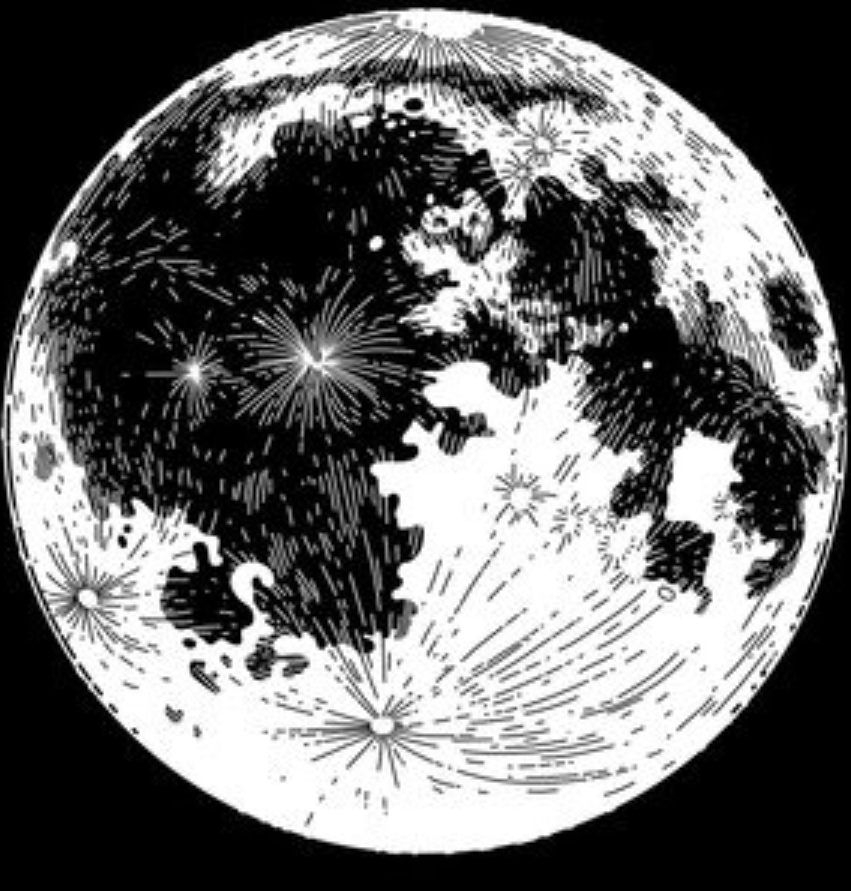

## Team members

**[Team leader - Amir Shaikh](https://github.com/amir-200)**
-
- Email - shaikhamir2888@gmail.com

**[Ayan Shaikh](https://github.com/ayan4955G/)**
-
- Email - ayanshaikhdev@gmail.com

**[Ovais Patel](https://www.github.com/octokatherine)**
-
- Email - patelovais830@gmail.com 

# PixelPerception

An image Classification Model using CNN and TensorFlow

Overview

This repository contains a convolutional neural network (CNN) model built using TensorFlow to classify images into various categories such as cat, dog, car, plane, etc. The model is designed to work with images of resolution 32x32 pixels.

[PPT hosted here](https://uppermoonobjectclassification.my.canva.site/)

Key Features

- Image classification model using CNN architecture
- Implemented using TensorFlow framework
- Optimized using Adam optimizer
- Achieved accuracy improvement from 35% to 95%
- Compatible with 32x32 pixel images

Model Details

- Convolutional Neural Network (CNN) architecture
- Input image resolution: 32x32 pixels
- Output categories: cat, dog, car, plane, etc.
- Optimizer: Adam
- Accuracy improvement: 35% to 95%

Usage

To use this model, simply clone the repository, install the required dependencies, and run the training script. You can modify the hyperparameters and experiment with different architectures to further improve the accuracy.

## Dataset Description

CIFAR-10 Dataset

The CIFAR-10 dataset is a widely-used benchmark for image classification tasks in computer vision. It consists of:

- 60,000 32x32 color images in 10 classes, with 6,000 images per class.
- 10 classes: airplane, automobile, bird, cat, deer, dog, frog, horse, ship, and truck.
- Training set: 50,000 images (5,000 per class)
- Testing set: 10,000 images (1,000 per class)

The images are:

- 32x32 pixels in size
- RGB color (3 channels)
- Unnormalized pixel values (0-255)

The CIFAR-10 dataset is a great resource for training and evaluating image classification models, particularly those using convolutional neural networks (CNNs). Its small size and balanced class distribution make it an ideal choice for rapid prototyping and experimentation.

## Dataset Split Info

Dataset Split

The dataset is split into two parts:

- Training set: 50% of the total dataset
- Testing set: 50% of the total dataset

## Approach

Machine Learning Model Approach

1. Data Ingestion: The model fetches the dataset file (with an extension of .csv).

2. Data Understanding: The model understands the data injection using TensorFlow.

3. Data Preprocessing: The data is cleaned, and preprocessing techniques are applied to prepare it for training.

4. Data Training: The training model is trained on the 32x32 RGB images.

5. Array Manipulation: Libraries like Numpy manipulate the arrays for efficient numerical computations.

6. Data Visualization: Matplotlib and Plotly libraries are used to plot the data and visualize the results, with Plotly providing more reactive graphs.

7. Model Training: Using Keras, the Sequential, Dense, and prominent CNN models are trained layer by layer.

8. Model Output: The output is trained on the older data from the CSV file.

9. Model Evaluation: The trained model is evaluated on the testing dataset to measure its performance.

10. Model Optimization: Adam optimization techniques is applied to improve the model's accuracy.

11. Model Deployment: The trained model is deployed for real-time image classification tasks.
## Result

## Dependences

The following dependencies are required to run the AI model:

- OpenCV: Used for image conversion and preprocessing.
- Matplotlib: Used to visualize the data and model performance.
- NumPy: Used for efficient matrix calculations and numerical computations.
- TensorFlow: The primary deep learning framework used to build and train the model.
- Keras: A high-level neural networks API, written in Python, used to build and train the model on top of TensorFlow.

## Refrences

YouTube Videos

- 3Blue1Brown (Grant Sanderson): Deep Learning and Neural Networks
- Sentdex: Python Programming and Machine Learning
- Siraj Raval: Machine Learning and AI
- TensorFlow: TensorFlow and Keras Tutorials
- PyImageSearch: Deep Learning and Computer Vision
